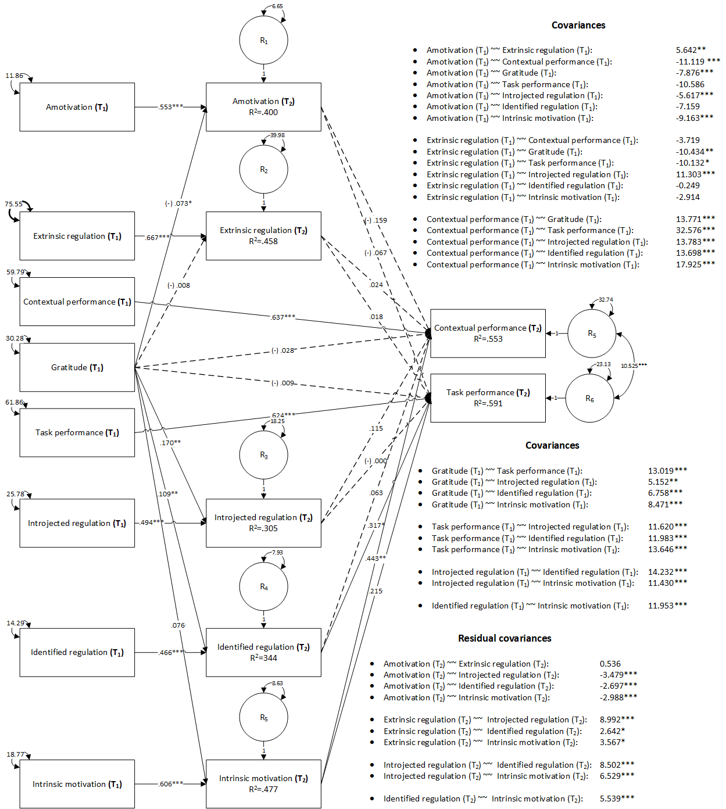
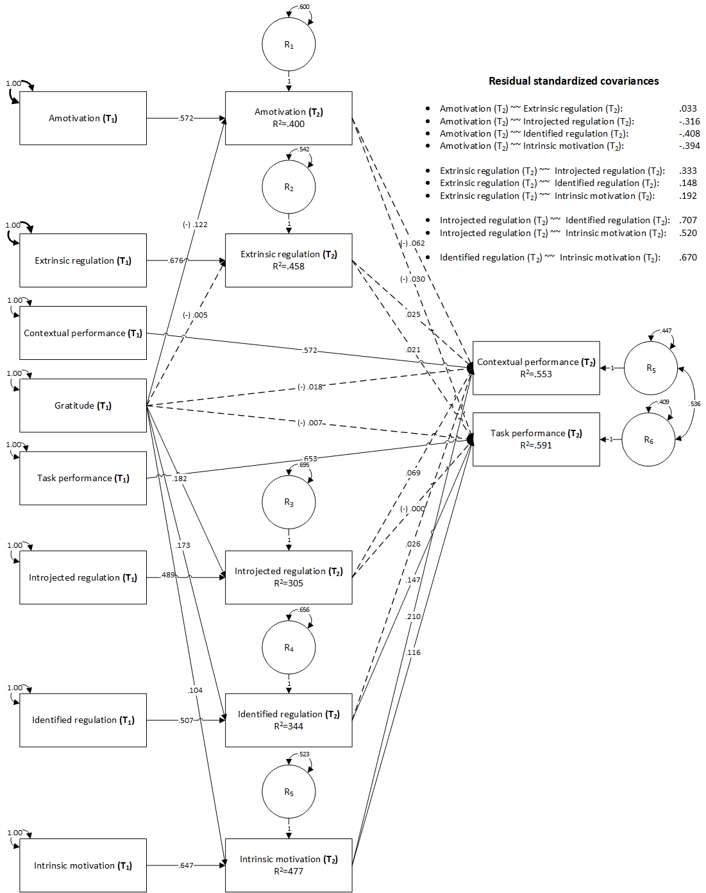

```{r setup, include = FALSE}
  library(papaja);library(kableExtra);library(foreign);library(dplyr);library(psych);library(lavaan)
  library(expss);library(rstatix);library(sasLM);library(Hmisc)
  r_refs("r-references.bib")
```

```{r analysis-preferences}
  # Seed for random number generation
  set.seed(421)
  knitr::opts_chunk$set(cache.extra = knitr::rand_seed)
```

# Introduction
\justify
[TO BE DONE BY GABI]


## The present study

# Methods
Internal consistency was assessed for all scales using the \(\alpha\) Cronbach indicator [@cronbach1951], and an initial descriptive analysis was conducted to assess the univariate normality assumptions for the scalar variables. The Mardia indicator [@Mardia-1970] was computed to assess multivariate normality and correlation matrix with means ans standard deviations was reported. For hypothesis testing, a path mediation model was used and the parameters were estimated using MLM (Mean adjusted Maximum Likelihood) robust method. Satorra-Bentler correction, was used for global fit testing because the assumption of multivariate normality was not fulfilled. The failure to fulfill the assumptions of univariate and multivariate normality will lead to the use of Spearman's \(\rho\) correlation matrix and some robust techniques to analyze the model.

We used `r cite_r("r-references.bib")` for all our analyses.

## Participants and Procedure
```{r participants, echo=FALSE, include=FALSE}
  source("01 - Measures.R")
  source("02 - Descriptives.R")
```
The study was approved by the institutional Research Ethics Committee. Participants were recruited by undergraduate Psychology students in exchange for extra credit in the Work Psychology course. They completed the measures twice, approximately 10 weeks apart, using a secure online platform. Initially, `r N` employees agreed to participate in the study. Out of them, `r n` (`r n.p`%) also completed the measures two and a half months later and were included in the final sample. Participants were aged between `r age.min` and `r age.max` years (M = `r age.m`, SD = `r age.sd`). They had an average tenure of `r ten.m` years in their current organizations (SD = `r ten.sd`) and worked in various fields (education, healthcare, IT, hospitality etc.). Other characteristics of the participants are summarized in Table ................. 

## Measures
```{r alpha, echo=FALSE}
   knitr::kable(crnb, format = "latex", digits = 2, booktabs = T, caption = "Cronbach's alpha coefficients and confidence intervals") %>%  kable_styling(latex_options="scale_down")
```
For all measures used in this study, items were scored on 7-point scale (1 = completely disagree, 7 = completely agree). The internal consistency coefficients for all the scales are displayed in Table \@ref(tab:alpha).

\center _Please Insert Table \@ref(tab:alpha) around here_ \justify

**Trait Gratitude.** Gratitude was measured using the Gratitude Questionnaire (McCullough et al., 2002). The six items of the questionnaire measure the frequency, intensity and density of gratitude in one's life (e.g., "If I had to list everything that I felt grateful for, it would be a very long list."). On our data, Cronbach's \(\alpha\) was \(\alpha\)=`r i=1; crnb[i,2]`, 95% CI [`r crnb[i,3]`, `r crnb[i,4]`].

**Work Motivation.** Employees' motivation was evaluated with The Multidimensional Work Motivation Scale (Gagné et al., 2015). The questionnaire has 19 items and assesses five types of work motivation: amotivation, extrinsic regulation, introjected regulation, identified regulation, and intrinsic motivation (e.g., "I don't know why I'm doing this job, it's pointless work."). Each subscale comprises 3 items, except for extrinsic regulation (6 items) and introjected regulation (4 items), and on our data, Cronbach's \(\alpha\) was \(\alpha\)=`r i=2; crnb[i,2]`, 95% CI [`r crnb[i,3]`, `r crnb[i,4]`] for amotivation, \(\alpha\)=`r i=3; crnb[i,2]`, 95% CI [`r crnb[i,3]`, `r crnb[i,4]`] for extrinsic regulation, \(\alpha\)=`r i=4; crnb[i,2]`, 95% CI [`r crnb[i,3]`, `r crnb[i,4]`] for introjected regulation, \(\alpha\)=`r i=5; crnb[i,2]`, 95% CI [`r crnb[i,3]`, `r crnb[i,4]`] for identified regulation, and \(\alpha\)=`r i=6; crnb[i,2]`, 95% CI [`r crnb[i,3]`, `r crnb[i,4]`] for intrinsic motivation.

**Job Performance.** Job performance was measured using a self-report version of the Job Performance Scale (Goodman and Svyantek, 1999). The scale assesses task performance (9 items; e.g., "I perform well in the overall job by carrying out tasks as expected") and contextual performance (7 items; e.g. "I assist my colleagues with their duties"). On our data, Cronbach's \(\alpha\) was \(\alpha\)=`r i=7; crnb[i,2]`, 95% CI [`r crnb[i,3]`, `r crnb[i,4]`] for task performance and \(\alpha\)=`r i=8; crnb[i,2]`, 95% CI [`r crnb[i,3]`, `r crnb[i,4]`] for contextual performance.

# Results
## Preliminary analysis
```{r descriptives, echo=FALSE}
   knitr::kable(print.univar, format = "latex", digits = 2, booktabs = T, caption = "Descriptive statistics for the primary variables") %>%  kable_styling(latex_options="scale_down")
```
Some moderated outliers were observed on all variables, without extreme values, and the assumption of univariate normality was not met (see Table \@ref(tab:descriptives)). The multivariate normality assumption based on Mardia coefficient [@Mardia-1970] was not met and a statistically significant multivariate positively skewed (Mardia = `r M.Sk`, Skewness = `r Sk`, p`r p.Sk`) and a large multivariate leptokurtic distribution (Mardia = `r M.K`, Kurtosis = `r K`, p`r p.K`) were observed.

\center _Please Insert Table \@ref(tab:descriptives) around here_ \justify

```{r corr-mat, echo=FALSE}
  options(knitr.kable.NA = "")
  kable(cor.mat$r, format = "latex", digits = 2, booktabs = T, caption = "Spearman zero-order correlation matrix") %>%  kable_styling(latex_options="scale_down")
```

\center _Please Insert Table \@ref(tab:corr-mat) around here_ \justify

 Most of the Spearman's \(\rho\) correlations were statistically significant (see Table \@ref(tab:corr-mat)), with values between `r cor.min` and `r cor.max`, and the correlation matrix was positively defined. At both measurement times, gratitude was positively related to task and contextual performance, introjected and identified regulation, as well as intrinsic motivation. Gratitude was also negatively related to amotivation and extrinsic regulation. Both task and contextual performance were negatively related to amotivation and positively linked to introjected and identified regulations and intrinsic motivation. Contextual performance was unrelated to extrinsic regulation. Task performance and extrinsic regulation were negatively related at T1, but not at T2.  


## Model analysis
```{r hypothesis, echo = FALSE, include = FALSE}
  source("03 - Model analysis.R")
```
The convergence was acquired after `r fit.rez[1,1]` iterations, estimating `r fit.rez[1,2]` parameters, based on `r fit.rez[1,3]` cases, resulting an over identified model with marginal fit indices (\(\chi\)^2^=`r fit.rez[1,4]`, df=`r fit.rez[1,5]`, p `r fit.rez[1,6]`, CFI=`r fit.rez[1,7]`, SRMR=`r fit.rez[1,8]`, RMSEA= `r fit.rez[1,9]`, p `r fit.rez[1,12]`,  90% CI [`r fit.rez[1,10]`, `r fit.rez[1,11]`]).

```{r Model-B, fig.align='center', fig.cap='Mediation model. Unstandardized coefficients', out.width=500}
  
```
```{r Model-Beta, fig.align='center', fig.cap='Mediation model. Standardized coefficients', out.width=500}
  #
```
\center _Please Insert Figures \@ref(fig:Model-B) and \@ref(fig:Model-Beta) around here_ \justify

Two positive and marginally significant indirect effects were identified, from the initial measurement of *gratitude* to the final measurement of *contextual performance*, mediated by the final measurement of *intrinsic motivation* (B=`r i=29; effects[i,4]`, z=`r effects[i,6]`, p=`r effects[i,7]`, \(\beta\)=`r effects[i,8]`), and from the initial measurement of *gratitude* to the final measurement of *task performance*, mediated by the final measurement of *identified regulation* (B=`r i=33; effects[i,4]`, z=`r effects[i,6]`, p=`r effects[i,7]`, \(\beta\)=`r effects[i,8]`). The initial measurements for *gratitude* were positively and marginally significantly associated with the final measurements for *intrinsic motivation* (B=`r i=10; effects[i,4]`, z=`r effects[i,6]`, p=`r effects[i,7]`, \(\beta\)=`r effects[i,8]`), and the final measurements of *intrinsic motivation* were positively and statistically significantly associated with the final measurements of *contextual performance* (B=`r i=17; effects[i,4]`, z=`r effects[i,6]`, p=`r effects[i,7]`, \(\beta\)=`r effects[i,8]`). The initial measurements for *gratitude* were also positively and statistically significantly associated with *identified regulation*, and the final measurements for *identified regulation* were positively and statistically significantly associated with *task performance* (B=`r i=23; effects[i,4]`, z=`r effects[i,6]`, p=`r effects[i,7]`, \(\beta\)=`r effects[i,8]`), therefore both mediated effects were marginally significant and positive.

No other indirect association were observer, however our data suggested a positive and statistically significant association between the final measurements for *intrinsic motivation* and the final measurements for *task performance* (B=`r i=24; effects[i,4]`, z=`r effects[i,6]`, p=`r effects[i,7]`, \(\beta\)=`r effects[i,8]`). Statistically significant positive associations were also observed between the initial measurements of *gratitude* and final measurements of *identified regulation* (B=`r i=7; effects[i,4]`, z=`r effects[i,6]`, p=`r effects[i,7]`, \(\beta\)=`r effects[i,8]`), and *intrinsic motivation* (B=`r i=10; effects[i,4]`, z=`r effects[i,6]`, p=`r effects[i,7]`, \(\beta\)=`r effects[i,8]`), whereas negative associations were observed with the final measurements of *amotivation* (B=`r i=2; effects[i,4]`, z=`r effects[i,6]`, p=`r effects[i,7]`, \(\beta\)=`r effects[i,8]`), and *introjected regulation* (B=`r i=5; effects[i,4]`, z=`r effects[i,6]`, p=`r effects[i,7]`, \(\beta\)=`r effects[i,8]`). All longitudinal associations between the same variables measured at the initial and final moments were statistically significant and no other associations were observed.

# Discussion


\newpage

# References

::: {#refs custom-style="Bibliography"}
:::
