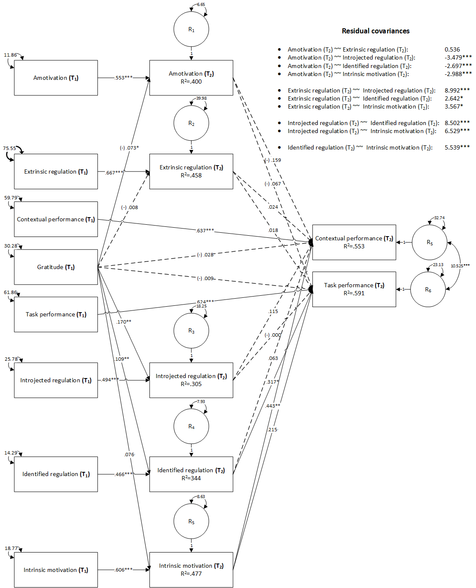

```{r setup, include = FALSE}
  library(papaja);library(kableExtra);library(foreign)
  r_refs("r-references.bib")
```

```{r analysis-preferences}
  # Seed for random number generation
  set.seed(421)
  knitr::opts_chunk$set(cache.extra = knitr::rand_seed)
```

# Introduction
\justify
[TO BE DONE BY GABI]


## The present study

```{r Model, fig.align='center', fig.cap='Theoretical mediation model', out.width=500}
  
```
\center _Please Insert Fig. \@ref(fig:Model) around here_ \justify

# Methods
A path mediation model was used and the parameters were estimated using MLM (Mean adjusted Maximum Likelihood) robust method. Satorra-Bentler correction, was used for global fit testing because the assumption of multivariate normality was not fulfilled.


We used `r cite_r("r-references.bib")` for all our analyses.
## Participants and Procedure

## Measurements

# Results
## Overview of data analysis


## Preliminary analysis

## Corelation analysis

## Model analysis
```{r hypothesis, echo = FALSE, include = FALSE}
  source("03 - Model analysis.R")
```
The convergence was acquired after `r fit.rez[1,1]` iterations, estimating `r fit.rez[1,2]` parameters, based on `r fit.rez[1,3]` cases, resulting an over identified model with marginal fit indices (\(\chi\)^2^=`r fit.rez[1,4]`, df=`r fit.rez[1,5]`, p `r fit.rez[1,6]`, CFI=`r fit.rez[1,7]`, SRMR=`r fit.rez[1,8]`, RMSEA= `r fit.rez[1,9]`, p `r fit.rez[1,12]`,  90% CI [`r fit.rez[1,10]`, `r fit.rez[1,11]`]).

```{r Model-B, fig.align='center', fig.cap='Mediation model. Unstandardized coefficients', out.width=500}
  
```
```{r Model-Beta, fig.align='center', fig.cap='Mediation model. Standardized coefficients', out.width=500}
  #knitr::include_graphics("Documents/Beta_Model.png")
```
\center _Please Insert Figures \@ref(fig:Model-B) and \@ref(fig:Model-Beta) around here_ \justify

Two positive and marginally significant indirect effects were identified, from the initial measurement of *gratitude* to the final measurement of *contextual performance*, mediated by the final measurement of *intrinsic motivation* (B=`r i=29; effects[i,4]`, z=`r effects[i,6]`, p=`r effects[i,7]`, \(\beta\)=`r effects[i,8]`), and from the initial measurement of *gratitude* to the final measurement of *task performance*, mediated by the final measurement of *identified regulation* (B=`r i=33; effects[i,4]`, z=`r effects[i,6]`, p=`r effects[i,7]`, \(\beta\)=`r effects[i,8]`). The initial measurements for *gratitude* were positively and marginally significantly associated with the final measurements for *intrinsic motivation* (B=`r i=10; effects[i,4]`, z=`r effects[i,6]`, p=`r effects[i,7]`, \(\beta\)=`r effects[i,8]`), and the final measurements of *intrinsic motivation* were positively and statistically significantly associated with the final measurements of *contextual performance* (B=`r i=17; effects[i,4]`, z=`r effects[i,6]`, p=`r effects[i,7]`, \(\beta\)=`r effects[i,8]`). The initial measurements for *gratitude* were also positively and statistically significantly associated with *identified regulation*, and the final measurements for *identified regulation* were positively and statistically significantly associated with *task performance* (B=`r i=23; effects[i,4]`, z=`r effects[i,6]`, p=`r effects[i,7]`, \(\beta\)=`r effects[i,8]`), therefore both mediated effects were marginally significant and positive.

No other indirect association were observer, however our data suggested a positive and statistically significant association between the final measurements for *intrinsic motivation* and the final measurements for *task performance* (B=`r i=24; effects[i,4]`, z=`r effects[i,6]`, p=`r effects[i,7]`, \(\beta\)=`r effects[i,8]`). Statistically significant positive associations were also observed between the initial measurements of *gratitude* and final measurements of *identified regulation* (B=`r i=7; effects[i,4]`, z=`r effects[i,6]`, p=`r effects[i,7]`, \(\beta\)=`r effects[i,8]`), and *intrinsic motivation* (B=`r i=10; effects[i,4]`, z=`r effects[i,6]`, p=`r effects[i,7]`, \(\beta\)=`r effects[i,8]`), whereas negative associations were observed with the final measurements of *amotivation* (B=`r i=2; effects[i,4]`, z=`r effects[i,6]`, p=`r effects[i,7]`, \(\beta\)=`r effects[i,8]`), and *introjected regulation* (B=`r i=5; effects[i,4]`, z=`r effects[i,6]`, p=`r effects[i,7]`, \(\beta\)=`r effects[i,8]`). All longitudinal associations between the same variables measured at the initial and final moments were statistically significant and no other associations were observed.


(B=`r i=5; effects[i,4]`, z=`r effects[i,6]`, p=`r effects[i,7]`, \(\beta\)=`r effects[i,8]`). 


# Discussion


\newpage

# References

::: {#refs custom-style="Bibliography"}
:::
